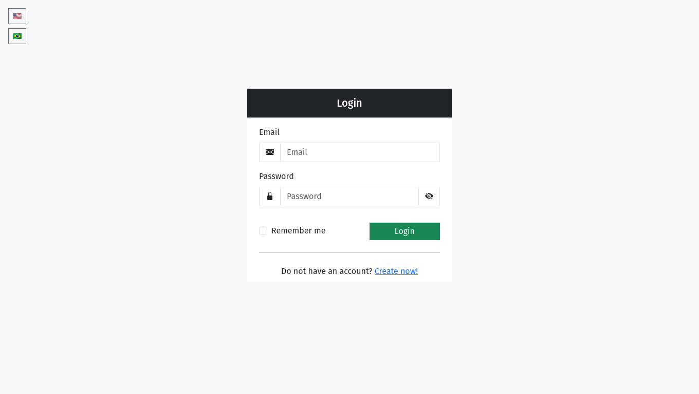
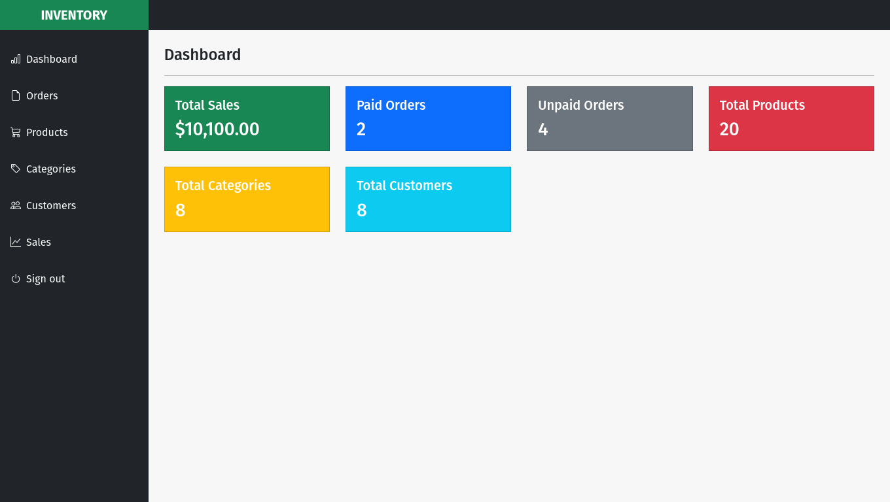
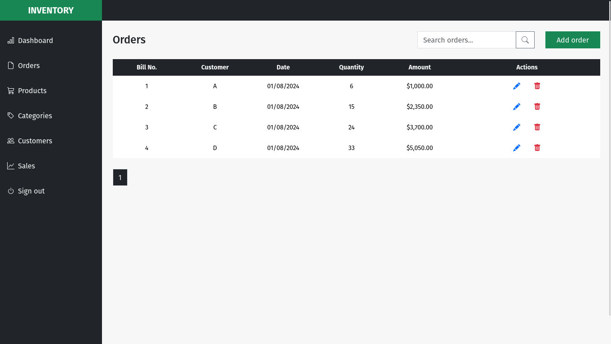
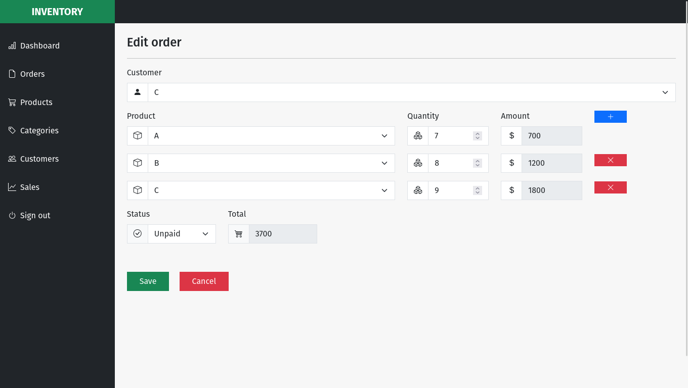

# Inventory Management System

## Overview

Inventory Management System is a simple prototype application for inventory management and control.

## Demonstration






## Features

- User can register their account.
- User can authenticate through the system.
- User can log out from the system.
- User can view information on dashboard.
- User can manage products.
- User can manage categories.
- User can manage customers.
- User can manage orders.
- User can manage sales.
- User can manage their account.

## Technologies

- Spring Boot
- Spring Web MVC
- Spring Security
- Spring Data JPA with Hibernate
- Thymeleaf
- Bootstrap
- AlpineJS
- Postgres

## Getting Started

### Prerequisites

* Docker

### Installing

Clone the project

```bash
  git clone https://github.com/AugustoRavazoli/inventory-management-system.git
```

Go to the project directory

```bash
  cd inventory-management-system
```

Start the application

```bash
  ./gradlew bootRun --args="--spring.profiles.active=local"
```

The application will start at `http://localhost:8080/`
with a default user with email `user@email.com` and password `password` with prefilled data.

### Tests

Use the following command to run tests.

```bash
  ./gradlew test
```

## License

This project is licensed under the Apache 2.0 License - see the LICENSE file for details.